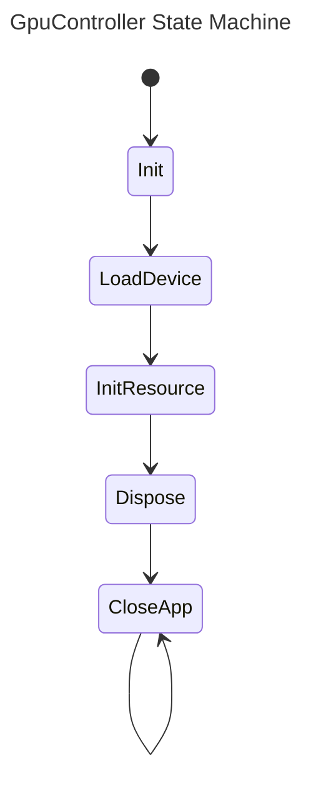

# References
- [rust::std](https://doc.rust-lang.org/std/index.html)

# `xynok_std::patterns`
---
Provide a subset of prebuilt patterns to control application state transitions, including the current state, next state, and redirection logic.

## [Linear State Machine Type State](examples/state_machine_type_state.rs)

